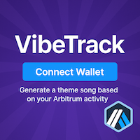

<p align="center">
  
</p>

<h1 align="center">🎵 VibeTrack – Arbitrum Wallet Vibes for Farcaster</h1>

<p align="center">
  <a href="https://vitejs.dev"></a>
  <a href="https://farcaster.xyz/?launchFrameUrl=https%3A%2F%2Fv1b3dis.onrender.com%2F"></a>
  <a href="https://github.com/arbitrum"></a>
  
  
</p>

<p align="center">
  <b>Analyze your Arbitrum wallet's onchain vibe, get a theme song, and share your results to Farcaster!</b>
</p>

---

## ✨ Live Demo

> 🚀 **Try it now:** [VibeTrack Mini App](https://farcaster.xyz/?launchFrameUrl=https%3A%2F%2Fv1b3dis.onrender.com%2F)


---

## 🎯 Features

- 🔗 **Connect your wallet** (Warpcast-native or browser wallets)
- 🧙‍♂️ **Analyze your Arbitrum wallet's onchain vibe**
- 🎶 **Get a theme song and fun description**
- 🟣 **Share your results to Farcaster via ComposeCast**
- 🎨 **Modern UI** with Tailwind CSS and Arbitrum branding

## 🛠️ Quick Start

```bash
# 1. Clone the repo
$ git clone https://github.com/hummusonrails/v1b3.git
$ cd vibe-track

# 2. Install dependencies
$ npm install

# 3. Run locally
$ npm run dev
```

> 💡 **Tip:** Update your `public/.well-known/farcaster.json` and `<meta name="fc:frame">` in `index.html` with your production URL before deploying!

---

## 🧩 Farcaster Mini App Integration

### 📄 Manifest (`farcaster.json`)

- Served from `public/.well-known/farcaster.json`
- Fields: `name`, `description`, `icon`, `appUrl`, `splashBackgroundImageUrl`, `requiredCapabilities`
- Update `appUrl` to your deployed app URL before launch
- Serve a static image for `splashBackgroundImageUrl` (e.g., `/splash.png`)

### 🖼️ Frame Embed (`fc:frame`)

Add this to your `index.html` to make your app shareable in Farcaster feeds:

```html
<head>
  <!-- other tags -->
  <meta name="fc:frame" content='{"version":"next","imageUrl":"/splash.png","button":{"title":"Open","action":{"type":"launch_frame","name":"VibeTrack","url":"https://your-app-url.xyz"}}}' />
</head>
```

---

## 💻 Tech Stack

- [Vite](https://vitejs.dev)
- [React](https://react.dev)
- [Tailwind CSS](https://tailwindcss.com)
- [@farcaster/create-mini-app](https://github.com/farcasterxyz/frames/tree/main/packages/create-mini-app)
- [wagmi.sh](https://wagmi.sh/)

---

## 🤝 Contributing

Contributions, issues and feature requests are welcome!<br>
Feel free to check [issues page](https://github.com/hummusonrails/v1b3/issues) or submit a pull request.

1. Fork the repo
2. Create your feature branch (`git checkout -b feature/AmazingFeature`)
3. Commit your changes (`git commit -m 'Add some AmazingFeature'`)
4. Push to the branch (`git push origin feature/AmazingFeature`)
5. Open a pull request

---

## 🌐 Community & Support

- [Farcaster](https://farcaster.xyz/)
- [Arbitrum](https://arbitrum.io/)
- [File an Issue](https://github.com/hummusonrails/v1b3/issues)

---

<p align="center">
  
  
</p>

---

<p align="center">
  <b>Made with ❤️ for the Farcaster & Arbitrum community</b>
</p>
